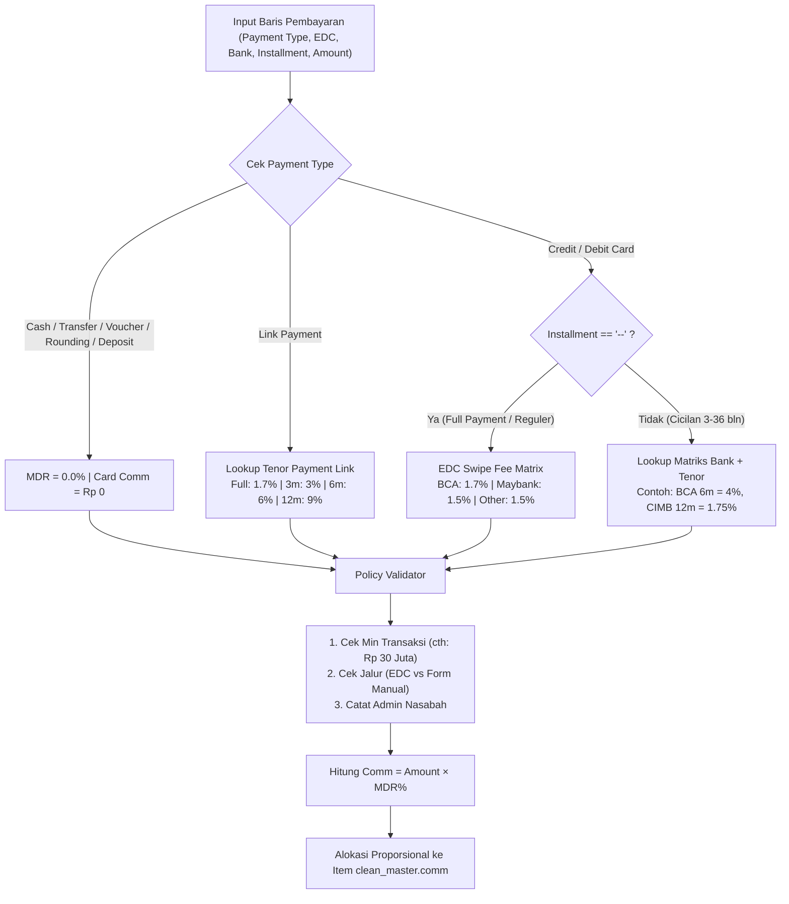

# BVLGARI POS Payment Breakdown & Smart MDR Rule Engine

Skill ini merupakan panduan arsitektur, SOP perbankan, matriks komisi kartu (*Merchant Discount Rate* / MDR), serta spesifikasi teknis untuk mengintegrasikan antarmuka pembayaran Point of Sale (POS) ke dalam Web Dashboard BVLGARI (`dashboard-bvl-v2`) dan Mobile Apps (`Mobile-Apps-MRA-Retail`).

---

## 1. Latar Belakang & Prinsip Utama (*Core Principles*)

### Masalah Operasional
1. Data transaksi harian ditarik dari API Bvlgari / POS via sinkronisasi ke tabel `clean_master`. API pusat hanya membawa data item *(qty, gross, disc, net)* tanpa detail mesin EDC atau jenis kartu, sehingga nilai `comm` berstatus default `0`.
2. Pada transaksi riil butik (Plaza Indonesia, Plaza Senayan, Bali), customer sering memecah pembayaran (*Split Payment*):
   - Contoh: Belanja Rp 100.000.000 dibayar Rp 20 Juta Cash + Rp 30 Juta Gesek EDC BCA Reguler (1.7%) + Rp 50 Juta Cicilan CIMB 12 Bulan (1.75%).
3. Kasir/Store Manager sebelumnya harus menghitung manual menggunakan kalkulator luar lalu mengetik angka ke kolom komisi. Proses ini lambat, rawan salah persentase, dan tidak memiliki riwayat audit kartu.

### Tiga Prinsip Mutlak (Non-Negotiable)
1. **Zero Disruption**:
   - Kolom `clean_master.comm` dan `bvlgari_sales.card_comm` bertipe `numeric` tetap dipertahankan tanpa perubahan skema destruktif.
   - Fitur edit manual di Web (`InvoiceTable.tsx`) dan Mobile (`sales_service.dart`) **tetap berfungsi 100%**. Split payment bertindak sebagai kalkulator cerdas *(intelligent assistant)*, bukan pembatas kaku.
2. **Finance-Driven Configuration**:
   - Master persentase MDR dan opsi pembayaran dikelola secara terpusat oleh Tim Finance tanpa perlu mengubah kode program (*decoupled*).
3. **POS Field-Parity**:
   - Formulir input rincian pembayaran di web dibuat **identik 100%** dengan kolom Point of Sale (POS) kasir di butik.

---

## 2. Dropdown POS Master Mapping

Formulir POS kasir memuat 6 kolom pembayaran:

### A. `Payment Type` (8 Opsi Utama)
- `--` *(Kosong / Default)*
- `Cash`
- `Credit Card`
- `Debit Card`
- `Deposit`
- `Link Payment`
- `Rounding`
- `Transfer`
- `Voucher`

### B. `EDC` (14 Opsi Mesin)
- `--`
- `AMEX`
- `BCA`
- `BNI`
- `BRI`
- `CIMB Niaga`
- `CitiBank`
- `Danamon`
- `HSBC`
- `Mandiri`
- `MayBank`
- `OCBC`
- `Permata`
- `UOB`
- `Other`

### C. `Card Type` (7 Opsi Jaringan Kartu)
- `--`
- `AMEX`
- `BCA CARD`
- `JCB`
- `MASTER`
- `UNIONPAY`
- `VISA`
- `Other`

### D. `Installment` (Tenor Cicilan)
- `--` *(Full Payment / Reguler Non-Cicilan)*
- `3 mth` *(3 Bulan)*
- `6 mth` *(6 Bulan)*
- `12 mth` *(12 Bulan)*
- `18 mth` *(18 Bulan)*
- `24 mth` *(24 Bulan)*
- `36 mth` *(36 Bulan)*

### E. `Bank` (Bank Penerbit Kartu)
- `BCA`, `BNI`, `BRI`, `CIMB Niaga`, `Danamon`, `DBS`, `HSBC`, `Mandiri`, `OCBC`, `Permata`, `UOB`, `MayBank`, `CitiBank`, `Other`.

---

## 3. Matriks Master MDR & SOP Kerjasama Bank

Berdasarkan dokumen master `Cicilan 0% Bvlgari & Kerjasama Mall.xlsx`:

### A. Matriks Tenor, MDR, & Metode Pemrosesan

| No | Bank Mitra | Min. Transaksi | 3 bln | 6 bln | 12 bln | 18 bln | 24 bln | 36 bln | Jalur Proses | Biaya Admin Nasabah | Berlaku di |
|:---:|:---|:---:|:---:|:---:|:---:|:---:|:---:|:---:|:---|:---:|:---|
| 1 | **AMEX BCA** | Rp 30.000.000 | **5.0%** | **5.0%** | **5.0%** | *Tactical* | *Tactical* | *Tactical* | Mesin EDC BCA | — | All Stores |
| 2 | **BCA** (Visa/MC) | Rp 10 Jt (3m)<br>Rp 30 Jt (6/12m) | **3.0%** | **4.0%** | **5.0%** | — | **8.0%** | **15.0%** | EDC BCA & Manual | — | All Stores |
| 3 | **BNI** | Rp 30.000.000 | — | **5.0%** | **7.0%** | **8.0%** | **9.0%** | — | Mesin EDC BNI | — | All Stores |
| 4 | **BRI** | Rp 30.000.000 | **2.0%** | **2.0%** | **3.0%** | **3.0%** | **3.0%** | — | Mesin EDC BRI | — | All Stores |
| 5 | **CIMB Niaga** | Rp 50.000.000 | — | **1.75%** | **1.75%** | — | **1.75%** | — | Mesin EDC CIMB | — | All Stores |
| 6 | **Danamon** | Rp 30.000.000 | **0.0%** | **0.0%** | **1.8%** | — | — | — | **Form Manual** | Rp 15.000 | All Stores |
| 7 | **DBS** | Rp 30.000.000 | **2.0%** | **3.0%** | **4.0%** | — | — | — | **Form Manual** | Rp 15.000 | **Khusus PI & PS** |
| 8 | **HSBC** | Rp 30.000.000 | — | **3.5%** | **5.0%** | — | — | — | **Form Manual** | — | All Stores |
| 9 | **Mandiri** | Rp 30.000.000 | — | **4.0%** | **5.0%** | **8.0%** | — | — | Mesin EDC Mandiri | — | All Stores |
| 10 | **OCBC** | Rp 30.000.000 | **0.0%** | **0.0%** | **0.0%** | **0.0%** | **0.0%** | — | **Form Manual** | Rp 15.000 | All Stores |
| 11 | **Permata** | Rp 30.000.000 | **0.0%** | **0.0%** | **5.0%** | — | — | — | **Form Manual** | Rp 25.000 | All Stores |

### B. Biaya Gesek EDC Reguler (Non-Cicilan / Full Payment)
- EDC **BCA**: **1.7%**
- EDC **MayBank (BII)**: **1.5%**
- EDC Lainnya (Mandiri, BNI, BRI, CIMB): **1.5% - 1.7%**

### C. BCA Payment Link (Jarak Jauh)
- Pembayaran Penuh (Reguler): **1.7%**
- Cicilan 0% Kartu BCA:
  - 3 Bulan: **3.0%**
  - 6 Bulan: **6.0%**
  - 12 Bulan: **9.0%**
  - 24 Bulan: *(Dinonaktifkan)*
  - Minimum Transaksi Cicilan: Rp 10.000.000,-

### D. SOP Temporary Top-Up Limit (Kenaikan Limit Cepat 30–60 Menit)
1. **BCA**:
   - Office Hour (Senin–Jumat 08.00–17.00): UPK Jakarta (`pemrosesan_kredit@bca.co.id`, cc `bertasia_simanjuntak@bca.co.id`).
   - After Office Hour / Weekend: Otorisasi Nasional (`Otorisasi@bca.co.id`).
   - Syarat Mutlak: Wajib nomor NPWP cardholder (jika lupa, batas update maks H+5 ke Halo BCA).
2. **CIMB Niaga**:
   - PIC: Ibu Ingky (0819-0505-6755 / 021-29972400 ext. 87008). Jam: 10.00–22.00 (Senin–Sabtu).

---

## 4. Arsitektur Smart Rule Engine

### Hierarchy / Decision Pipeline



### Rumus Alokasi Proporsional (Multi-Item Invoice)
Jika invoice memiliki $N$ barang dengan nilai total net sales $T$, maka komisi untuk item ke-$i$ dihitung:

$$\text{comm}_i = \text{Total Card Comm} \times \left( \frac{\text{net\_sales}_i}{T} \right)$$

---

## 5. Struktur Data TypeScript & State Model

```typescript
export interface PaymentSplitRow {
  id: string;
  paymentType: 'Cash' | 'Credit Card' | 'Debit Card' | 'Deposit' | 'Link Payment' | 'Rounding' | 'Transfer' | 'Voucher' | '--';
  edc: string;           // 'BCA', 'Mandiri', 'MayBank', '--', dll.
  installment: string;   // '--', '3 mth', '6 mth', '12 mth', '18 mth', '24 mth', '36 mth'
  bank: string;          // 'BCA', 'CIMB Niaga', 'Danamon', dll.
  cardType: string;      // 'VISA', 'MASTER', 'BCA CARD', 'JCB', 'AMEX', 'UNIONPAY', 'Other', '--'
  amount: number;        // Nominal IDR
  mdrPct: number;        // Persentase terhitung otomatis (misal 0.04 = 4%)
  cardComm: number;      // amount * mdrPct
  processMethod?: 'EDC' | 'MANUAL_FORM';
  warningNote?: string;  // Peringatan min transaksi atau admin fee
}

export interface InvoicePaymentPayload {
  transNo: string;
  totalInvoiceAmount: number;
  totalPaidAmount: number;
  totalCardComm: number;
  effectiveMdrPct: number;
  splits: PaymentSplitRow[];
  updatedBy?: string;
  updatedAt: string;
}
```

---

## 6. Checklist Implementasi Web Dashboard

- [ ] **Sidebar Grouping**: Tambahkan grouping `FINANCE` di `Sidebar.tsx` yang memuat `Cicilan & MDR Guide` (`/installment-guide`), `Payment & MDR Setup` (`/finance-settings`), dan link ke `Invoice Management`.
- [ ] **Simulator Halaman `/installment-guide`**: Buat kalkulator simulasi 11 bank + direktori syarat kartu + kontak darurat Top Up Limit.
- [ ] **Modal Payment Breakdown di `/invoice-management`**:
  - Tombol `[💳 Payment / Card Comm]` pada setiap baris invoice.
  - Tabel 10 baris atau dynamic rows dengan 6 kolom POS.
  - Kolom preview otomatis: `MDR (%)` dan `Card Comm (IDR)`.
  - Verifikasi `Total Amount == Payment`.
  - Tombol `[Set Payment]` yang menyimpan total komisi ke `clean_master.comm` dan rincian split ke `transaction_records_meta`.
- [ ] **Pengujian Lokal**: Jalankan `npm run dev` pada `localhost:3000` dan verifikasi semua skenario split payment sebelum deploy ke produksi.
