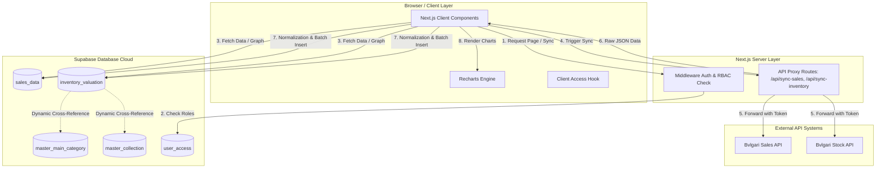

# Dokumentasi Integrasi & Panduan Fungsional Aplikasi
**MRA Retail - Bvlgari Intelligence Dashboard**

Dokumen ini menyajikan panduan komprehensif mengenai **arsitektur integrasi** dan **spesifikasi fungsional** dari aplikasi Bvlgari Intelligence Dashboard. Dokumen ini ditujukan untuk memberikan pemahaman teknis dan operasional yang mendalam bagi manajemen, tim operasional, serta tim pengembang (*developers*).

---

## 🗺️ 1. Arsitektur & Integrasi Sistem

Aplikasi ini dibangun menggunakan arsitektur modern berbasis **Next.js (React)** dengan database **Supabase (PostgreSQL)**, yang berintegrasi langsung dengan API eksternal data transaksi dan inventaris Bvlgari.

### Diagram Alir Integrasi (System Architecture Flow)



### Penjelasan Komponen Utama Integrasi:
1.  **Next.js API Proxy Routes:** 
    *   API eksternal Bvlgari berada pada port khusus (`http://139.99.102.231:8089/`). Agar tidak terkena kendala **CORS (Cross-Origin Resource Sharing)** di sisi browser, aplikasi menggunakan Route Handler Next.js (`/api/sync-sales/route.ts` & `/api/sync-inventory/route.ts`) sebagai perantara (*reverse proxy*) yang menyertakan token otentikasi secara aman di server side.
2.  **Supabase PostgreSQL Database:**
    *   Berfungsi menyimpan data operasional sales dan snapshot inventaris secara terstruktur.
    *   Tabel Master (`master_main_category` dan `master_collection`) digunakan secara dinamis selama sinkronisasi stok untuk menerjemahkan kode mentah (*raw collection code*) menjadi nama kategori bersih (*Watches*, *Jewelry*, *Accessories*) dan nama koleksi resmi (*B.zero1*, *Serpenti*, dll.).
3.  **Role-Based Access Control (RBAC):**
    *   Sistem otorisasi terintegrasi melalui hook `useUserAccess` yang mencocokkan sesi user terdaftar dengan tabel `user_access` untuk menentukan halaman apa saja di sidebar yang boleh diakses.

---

## 📂 2. Panduan Fungsionalitas Modul (Menu Sidebar)

Aplikasi dibagi ke dalam 5 grup utama menu navigasi sesuai dengan hak akses dan kebutuhan bisnis:

### A. GROUP OVERVIEW (Analisis Eksekutif & Penjualan)
Grup ini digunakan oleh jajaran **Manajemen & Direksi** untuk memantau performa penjualan secara makro.

1.  **Monthly Overview**
    *   **Fungsi:** Menampilkan metrik utama penjualan bulanan (*Net Sales*, *Transactions Count*, *Average Ticket*, dan *Quantity Sold*) dalam bentuk KPI cards dan grafik garis bulanan.
    *   **Visualisasi:** Komparasi performa bulan berjalan dengan bulan sebelumnya.
2.  **Quarterly Standard**
    *   **Fungsi:** Analisis performa penjualan berdasarkan kuartal kalender (Q1, Q2, Q3, Q4) untuk melacak pertumbuhan bisnis musiman (*seasonal growth*).
3.  **Quarterly Budget**
    *   **Fungsi:** Membandingkan realisasi penjualan riil terhadap target budget yang telah ditetapkan per butik. Menampilkan persentase pencapaian (*achievement rate*) secara visual.
4.  **Annual Net Sales**
    *   **Fungsi:** Menyajikan tren penjualan tahunan untuk melihat performa jangka panjang dari tahun ke tahun.
5.  **Store Performance**
    *   **Fungsi:** Peringkat komparatif performa penjualan antar butik (butik Plaza Indonesia vs Plaza Senayan, dll.) untuk mengidentifikasi butik dengan kontribusi terbesar.
6.  **Forecasting (AI)**
    *   **Fungsi:** Menggunakan model matematika prediktif berbasis data historis untuk memproyeksikan estimasi penjualan pada bulan-bulan berikutnya.

---

### B. GROUP OPERASIONAL (Operasional & Stok)
Grup ini membantu **Tim Operasional (Operations Sales) & Logistik** dalam memantau data harian dan valuasi stok.

1.  **Daily Report**
    *   **Fungsi:** Menampilkan tren penjualan harian dalam satu bulan yang dipilih.
    *   **Fitur Spesial:** Secara otomatis mendeteksi hari kerja (*weekday*), akhir pekan (*weekend*), dan hari libur nasional (*national holiday*), serta menandainya dengan warna grafik berbeda agar analisis pengaruh hari libur terhadap penjualan lebih mudah dipahami.
2.  **Monthly Transactions**
    *   **Fungsi:** Menyajikan daftar seluruh transaksi rinci yang terjadi pada bulan berjalan dengan filter pencarian dan tombol ekspor Excel/CSV.
3.  **Heatmap Calendar**
    *   **Fungsi:** Visualisasi kalender bulanan interaktif di mana warna sel tanggal berubah tingkat kepekatannya (bergradasi hijau/merah) berdasarkan volume transaksi atau nilai penjualan pada hari tersebut.
4.  **Crossing Sales**
    *   **Fungsi:** Analisis korelasi produk silang untuk mengidentifikasi produk apa saja yang sering dibeli secara bersamaan dalam satu transaksi (*market basket analysis*).
5.  **Sales Data (Sync Engine)**
    *   **Fungsi:** Panel kontrol untuk menarik data sales terbaru dari API eksternal Bvlgari ke database lokal Supabase untuk tanggal atau bulan tertentu.
6.  **Inventory Valuation**
    *   **Fungsi:** Modul pelacakan nilai stok butik bulanan (*Retail Value*).
    *   **Fitur Utama Modul Inventory:**
        *   *KPI Utama:* Hanya berfokus menampilkan **Total Qty (QOH)** dan **Total Retail Value** (harga modal disembunyikan sepenuhnya demi keamanan data internal).
        *   *KPI Kategori:* Ringkasan khusus stok **Watches**, **Jewelry**, dan **Accessories** dalam unit (*Pcs*) dan *Retail Value*.
        *   *Exclusion PACK:* Secara otomatis menyaring dan menghilangkan item kemasan/kotak belanja (`PACK`) dari perhitungan agar data stok barang mewah tidak terdistorsi.
        *   *Pencarian & Ekspor:* Dilengkapi kolom tabel berdesain *stacked* (Badge Kategori di atas, Nama Koleksi di bawah), pencarian cepat, filter "Tanpa Perfume", dan ekspor CSV berformat UTF-8 BOM.
        *   *Grafik Kategori & Custom Tooltip:* Grafik batang horizontal interaktif yang menampilkan rangkuman nilai jual retail per kategori utama dengan tooltip putih premium yang bersih.

---

### C. GROUP PRODUK & ADVISOR (Analisis Penjualan Barang & Staff)
Grup ini membantu **Operations Manager & Merchandiser** untuk mengevaluasi produk dan staf penjualan.

1.  **Product Rank**
    *   **Fungsi:** Menampilkan daftar produk terlaris (*best-sellers*) berdasarkan kuantitas yang terjual maupun total nilai penjualan bersih.
2.  **Product Projection**
    *   **Fungsi:** Analisis stok tersisa dibanding kecepatan penjualan (*run-rate*) untuk memproyeksikan kapan suatu tipe produk akan habis sehingga tim merchandiser dapat melakukan *re-order* tepat waktu.
3.  **Advisor Setup**
    *   **Fungsi:** Pendaftaran dan pengelolaan data Sales Advisor (staf penjualan) yang bertugas di masing-masing butik.
4.  **Advisor Performance**
    *   **Fungsi:** Pelacakan KPI kontribusi sales per individu Advisor, persentase pencapaian target personal, dan jumlah transaksi yang berhasil mereka tangani.

---

### D. GROUP CRM & TRAFFIC (Manajemen Pelanggan & Kunjungan)
Grup ini digunakan oleh **Tim CRM (Customer Relationship Management)** untuk memantau perilaku pelanggan VIP dan kunjungan butik.

1.  **CRM Profiling**
    *   **Fungsi:** Profiling pelanggan berdasarkan riwayat belanja, rentang usia, domisili, dan preferensi produk (koleksi perhiasan atau jam tangan).
2.  **Event Selling Plan**
    *   **Fungsi:** Perencanaan acara pemasaran (*boutique private event*), penentuan target penjualan acara, serta pemetaan undangan pelanggan VIP.
3.  **App Sheet (CRM)**
    *   **Fungsi:** Integrasi formulir input data lapangan CRM secara langsung.
4.  **Footfall (Store)**
    *   **Fungsi:** Mencatat dan menganalisis jumlah pengunjung fisik (*traffic*) butik harian untuk dihitung rasio konversinya (*conversion rate = Transaksi / Pengunjung*).
5.  **Footfall (CRM)**
    *   **Fungsi:** Menganalisis efektivitas kunjungan pelanggan yang diundang oleh tim CRM ke butik.
6.  **Customer Segment**
    *   **Fungsi:** Pengelompokan pelanggan menggunakan metode RFM (Recency, Frequency, Monetary) untuk menyusun strategi promo yang tepat sasaran.
7.  **Clienteling Hub**
    *   **Fungsi:** Dasbor interaksi harian bagi Sales Advisor untuk memicu aksi *follow-up* pelanggan VIP (misal: ucapan selamat ulang tahun, pemberitahuan koleksi baru).

---

### E. GROUP ADMIN (Pengaturan Sistem)
Grup ini dikhususkan bagi **Super Admin & IT**.

1.  **User Access**
    *   **Fungsi:** Manajemen otorisasi pengguna. Di sini admin dapat menambahkan user baru, menonaktifkan akun, serta mengubah peran peran (*role*) user untuk mengatur batasan menu sidebar yang boleh diakses.

---

## ⚙️ 3. Panduan Operasional & Pemeliharaan (Developer Guide)

### Persyaratan Awal (Prerequisites)
*   **Node.js:** Versi 18.x atau 20.x (disarankan LTS).
*   **Database:** PostgreSQL (Supabase Cloud).

### File Konfigurasi Lingkungan (`.env.local`)
Aplikasi memerlukan file `.env.local` di direktori utama dengan variabel berikut:
```env
# Koneksi Database Supabase
NEXT_PUBLIC_SUPABASE_URL=https://your-project-id.supabase.co
NEXT_PUBLIC_SUPABASE_ANON_KEY=your-supabase-anon-key
SUPABASE_SERVICE_ROLE_KEY=your-supabase-service-role-key

# API Eksternal Bvlgari
EXTERNAL_API_BASE_URL=http://139.99.102.231:8089
EXTERNAL_API_TOKEN=token-otentikasi-anda
```

### Perintah Terminal Utama

1.  **Menjalankan Aplikasi secara Lokal (Development Mode):**
    ```bash
    npm run dev
    ```
    Aplikasi akan berjalan di `http://localhost:3000`.

2.  **Membuat Bundle Produksi (Production Build):**
    ```bash
    npm run build
    ```

3.  **Menjalankan Aplikasi Hasil Build:**
    ```bash
    npm start
    ```

4.  **Memeriksa Kesalahan TypeScript (Type Checking):**
    ```bash
    npx tsc --noEmit
    ```

> [!WARNING]
> Selalu pastikan variabel lingkungan `EXTERNAL_API_TOKEN` dan kunci koneksi Supabase terisi dengan benar di file `.env.local` server produksi sebelum melakukan *deployment*.
