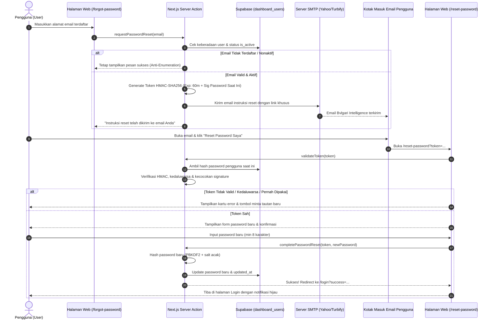

# Dokumentasi Sistem Autentikasi & Forgot Password
**Dashboard Bvlgari Intelligence — MRA Retail**  
*Versi: 2.0.0 | Terakhir Diperbarui: September 2026*

---

## 📌 Ringkasan Eksekutif

Sistem autentikasi pada Dashboard Bvlgari Intelligence menggunakan pendekatan **Custom Secure Session Token (HTTP-Only Cookie)** yang dipadukan dengan enkripsi kata sandi standar tinggi (**PBKDF2 + SHA-256**) dan sistem pemulihan kata sandi (**Forgot Password**) otomatis melalui server **SMTP Turbify/Yahoo**.

Fitur ini dirancang untuk:
1. Memberikan kemudahan bagi pengguna internal (staf sales, store manager, tim CRM, dan management) untuk mereset kata sandi secara mandiri tanpa harus meminta reset manual ke tim IT.
2. Memastikan keamanan data tingkat enterprise dengan jaminan token sekali pakai (*single-use guarantee*), pembatasan waktu kedaluwarsa 60 menit, serta perlindungan terhadap peretasan *user enumeration*.

---

## 🏗️ Diagram Alur Kerja (Workflow Architecture)



---

## 🔐 Spesifikasi Keamanan Kriptografi

### 1. Enkripsi Kata Sandi (Password Hashing)
- **Algoritma**: `PBKDF2` (Password-Based Key Derivation Function 2)
- **Digest**: `SHA-256`
- **Iterasi**: 100.000 kali perulangan
- **Garam (Salt)**: 16-byte kriptografi acak unik per pengguna (`crypto.getRandomValues`)
- **Format Penyimpanan**: `{saltHex}.{hashHex}` pada kolom `password` tabel `dashboard_users`.

### 2. Token Reset Password (HMAC-SHA256 Signed Token)
Format token reset terdiri dari dua bagian:
```
[Base64Payload].[HMAC_SHA256_Signature]
```
Payload berisi data:
```json
{
  "email": "aris@mraretail.co.id",
  "exp": 1789116390000,
  "purpose": "pwd_reset",
  "sig": "c115b75898e12490"
}
```

### 3. Jaminan Sekali Pakai (*Single-Use Guarantee*)
- Nilai `sig` di dalam token mengambil 16 karakter pertama dari hash password lama pengguna.
- Ketika pengguna berhasil membuat password baru, hash password di database berubah.
- Jika pengguna atau pihak lain mencoba membuka kembali tautan reset yang sama, verifikasi `sig` akan gagal karena hash di database sudah tidak sama dengan saat token dibuat. Tautan otomatis hangus tanpa memerlukan tabel sementara.

### 4. Perlindungan Anti-User Enumeration
- Saat form forgot password disubmit dengan email yang tidak terdaftar, sistem **tidak memberitahukan** bahwa email tidak ada.
- Sistem selalu memberikan respon seragam: *"Jika email terdaftar di sistem, instruksi reset password telah dikirim..."*. Hal ini mencegah penyerang menebak email staf yang aktif.

---

## 📧 Konfigurasi SMTP Email

Pengiriman email reset password dijalankan oleh `nodemailer` yang terhubung ke server SMTP resmi perusahaan:

| Pengaturan | Nilai Konfigurasi | Keterangan |
| :--- | :--- | :--- |
| **Host** | `smtp.bizmail.yahoo.com` | Server Turbify / Yahoo Business Mail |
| **Port** | `465` | SSL / Secure Connection |
| **User** | `aris@mraretail.co.id` | Alamat pengirim resmi |
| **Password** | Dikonfigurasi di `.env.local` (`SMTP_PASS`) | App password / kredensial aman |
| **Nama Pengirim** | `"Bvlgari Intelligence"` | Tampil di kotak masuk penerima |

---

## 📁 Struktur File & Direktori

```
src/
├── app/
│   ├── login/
│   │   ├── page.tsx          # UI Halaman Login (Show/Hide Password, Alert banner)
│   │   └── actions.ts         # Server Actions: login & logout session
│   ├── forgot-password/
│   │   ├── page.tsx          # UI Permintaan Reset Password
│   │   └── actions.ts         # Server Action: requestPasswordReset
│   └── reset-password/
│       ├── page.tsx          # UI Form Password Baru & Meter Kekuatan Password
│       └── actions.ts         # Server Actions: validateToken & completePasswordReset
├── services/
│   └── emailService.ts       # Service pengirim email HTML resmi Bvlgari via Nodemailer
└── utils/
    └── auth.ts               # Fungsi enkripsi PBKDF2, session JWT, & token reset HMAC
```

---

## 🛠️ Panduan Penggunaan & Pengujian

### A. Menguji Alur Forgot Password di Browser
1. Buka URL: `https://dashboard-bvl.mraretail.co.id/login` (atau `http://localhost:3000/login`).
2. Klik tautan **"Lupa Password?"**.
3. Masukkan alamat email akun Anda (contoh: `aris@mraretail.co.id`).
4. Klik tombol **"Kirim Tautan Reset Password"**.
5. Buka inbox email Anda; cari email dengan subjek:  
   `Permintaan Reset Password - Bvlgari Intelligence`.
6. Klik tombol biru **"Reset Password Saya →"**.
7. Anda akan diarahkan ke form pembuatan password baru:
   - Ketik password baru (minimal 8 karakter).
   - Ketik ulang di kolom konfirmasi password.
8. Klik **"Simpan Password Baru"**.
9. Sistem akan mengonfirmasi pembaruan dan mengalihkan Anda kembali ke halaman Login. Masuk menggunakan password baru Anda.

### B. Reset Password Pengguna Secara Manual (Admin/Emergency)
Jika terdapat kondisi darurat di mana pengguna tidak memiliki akses email, administrator dapat menggunakan skrip darurat di server untuk mengubah password pengguna langsung:

```javascript
// Jalankan via node di direktori proyek
const { createClient } = require('@supabase/supabase-js');
const { hashPassword } = require('./src/utils/auth');

async function manualReset(userEmail, newPasswordPlain) {
  const supabase = createClient(process.env.NEXT_PUBLIC_SUPABASE_URL, process.env.NEXT_PUBLIC_SUPABASE_ANON_KEY);
  const newHash = await hashPassword(newPasswordPlain);
  
  await supabase
    .from('dashboard_users')
    .update({ password: newHash, updated_at: new Date().toISOString() })
    .eq('email', userEmail);
    
  console.log(`Password untuk ${userEmail} berhasil diubah.`);
}
```

---

## ❓ FAQ & Troubleshooting

#### Q: Pengguna tidak menerima email reset password?
1. Periksa folder **Spam / Junk** pada aplikasi email.
2. Pastikan email yang dimasukkan sama persis dengan yang terdaftar di database `dashboard_users`.
3. Periksa kuota / status server SMTP dengan menjalankan skrip verifikasi:
   ```bash
   node scratch/check_smtp.js
   ```

#### Q: Tautan reset memunculkan pesan "Tautan Tidak Valid atau Kedaluwarsa"?
Hal ini terjadi karena salah satu dari 3 kondisi:
- Tautan sudah melewati batas waktu 60 menit sejak dikirim.
- Tautan tersebut sudah pernah diklik dan digunakan untuk mereset password sebelumnya.
- Pengguna meminta tautan baru lagi setelahnya (tautan terbaru akan membatalkan tautan yang lebih lama).
Solusi: Pengguna cukup membuka kembali `/forgot-password` dan meminta tautan baru.
